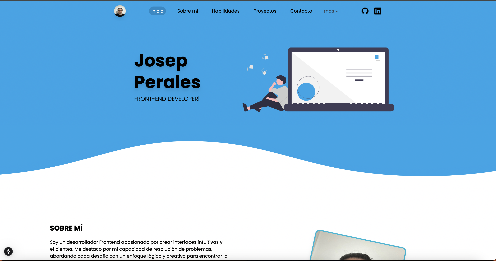

# 🧑‍💻 Portafolios

Este es un proyecto de portafolio profesional desarrollado con **Next.js 14**, utilizando **Tailwind CSS** y el sistema de rutas `App Router`. Está optimizado para ser una aplicación responsiva, moderna y fácil de mantener, ideal para mostrar proyectos y habilidades de manera profesional.

---

## 🚀 Demo en Vivo

🔗 [portafolio-josep.vercel.app](https://portafolio-josep.vercel.app)

---

## 🖼️ Vista Previa




## 🛠️ Tecnologías

- [Next.js 14 (App Router)](https://nextjs.org/)
- [Tailwind CSS](https://tailwindcss.com/)
- [TypeScript](https://www.typescriptlang.org/)
- [pnpm](https://pnpm.io/) como gestor de paquetes

---

## 📁 Estructura del Proyecto
```plaintext
portafolios/
│
├── app/              # Rutas y páginas principales
├── components/       # Componentes reutilizables
├── context/          # Context API (global state)
├── data/             # Datos estáticos
├── public/           # Recursos públicos (imágenes, íconos, etc.)
├── styles/           # Archivos de estilos (globals.css)
├── utils/            # Funciones utilitarias
├── .eslintrc         # Configuración de ESLint
├── tailwind.config.ts
└── next.config.ts
```
---

## 📦 Instalación

Sigue los pasos a continuación para clonar y ejecutar el proyecto localmente:

### 1. Clonar el repositorio

```bash
git clone https://github.com/josep100/portafolios.git
```

### 2. Acceder al directorio del proyecto
```bash
cd portafolios
```

### 3. Instalar las dependencias Usando pnpm (recomendado):
```bash
pnpm install
```
También puedes usar npm o yarn:
```bash
npm install
# o
yarn install
```

## 🧪 Modo Desarrollo

### 1. Inicia el servidor de desarrollo:
```bash
pnpm dev
```
### 2. Abre tu navegador en:
```bash
http://localhost:3000
```
